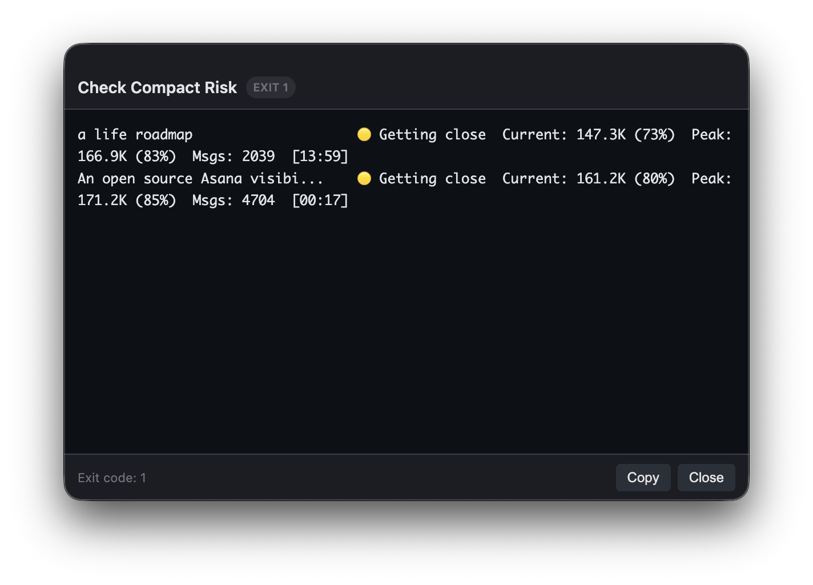

# Claude Code Context Monitor

A lightweight bash script that monitors your active [Claude Code](https://docs.anthropic.com/en/docs/claude-code) sessions and alerts you when they're approaching the auto-compaction threshold — so you can run `/compact` on your own terms and preserve session memory.



## Why?

Claude Code auto-compacts your session when the context window fills up (~83% of 200K tokens). When that happens, you lose the opportunity to guide the compaction — session memory, implementation context, and continuity between work blocks can degrade.

This script scans your active session files, calculates token usage, and tells you which sessions need attention before auto-compaction kicks in.

## Quick Start

```bash
# Download
curl -O https://raw.githubusercontent.com/avanrossum/claude-context-monitor/main/claude-context-monitor.sh
chmod +x claude-context-monitor.sh

# Run
./claude-context-monitor.sh
```

## Output

```
═══ Claude Code Context Monitor ═══
Context window: 200K tokens  |  Red Alert: 85%  |  Warning: 70%

a life roadmap                    🟡 Getting close  Current: 147.3K (73%)  Peak: 161.2K (80%)  Msgs: 2039  [13:59]
An open source Asana visibi...    🟡 Getting close  Current: 171.2K (85%)  Peak: 161.2K (80%)  Msgs: 4704  [00:17]

Tip: Run /compact in Claude Code before auto-compaction to preserve memory
```

Status indicators:
- **🟢 OK** — Under the warning threshold
- **🟡 Getting close** — Above warning threshold (default: 70%)
- **🔴 COMPACT NOW** — Above red alert threshold (default: 85%)

## Options

| Flag | Default | Description |
|------|---------|-------------|
| `--warn-at N` | `70` | Percentage threshold for yellow warnings |
| `--red-at N` | `85` | Percentage threshold for red alert warnings |
| `--max-age N` | `24` | Only check sessions modified within N hours |
| `--context N` | `200` | Context window size in K tokens |
| `--quiet` | off | Only produce output if warnings are found |
| `--notify` | off | Show a macOS alert when warnings are found |
| `--alert-life N` | `5` | Number of seconds to show the macOS alert |

### Examples

```bash
# Just show sessions that need attention
./claude-context-monitor.sh --quiet

# Lower the warning threshold to 60%
./claude-context-monitor.sh --warn-at 60

# macOS alert when sessions are at risk (shows for 10 seconds)
./claude-context-monitor.sh --quiet --notify --alert-life 10

# Future-proof: if Claude Code increases the context window
./claude-context-monitor.sh --context 500
```

## Run on a Schedule

### cron

```bash
# Check every 15 minutes, notify on warnings
*/15 * * * * /path/to/claude-context-monitor.sh --quiet --notify
```

### launchd (macOS native)

Create `~/Library/LaunchAgents/com.claude-context-monitor.plist`:

```xml
<?xml version="1.0" encoding="UTF-8"?>
<!DOCTYPE plist PUBLIC "-//Apple//DTD PLIST 1.0//EN" "http://www.apple.com/DTDs/PropertyList-1.0.dtd">
<plist version="1.0">
<dict>
    <key>Label</key>
    <string>com.claude-context-monitor</string>
    <key>ProgramArguments</key>
    <array>
        <string>/path/to/claude-context-monitor.sh</string>
        <string>--quiet</string>
        <string>--notify</string>
    </array>
    <key>StartInterval</key>
    <integer>900</integer>
</dict>
</plist>
```

Then load it:
```bash
launchctl load ~/Library/LaunchAgents/com.claude-context-monitor.plist
```

## How It Works

1. Scans `~/.claude/projects/` for active session JSONL files
2. Parses token usage from API response metadata in assistant messages (input tokens + cache creation + cache read)
3. Calculates percentage of context window used
4. Color-codes each session by risk level
5. Exits with code 1 if any warnings found (useful for scripting)

## Requirements

- macOS (uses `stat -f` and `osascript` for notifications)
- Python 3 (for JSONL parsing — comes pre-installed on macOS)
- [Claude Code](https://docs.anthropic.com/en/docs/claude-code) installed

## Exit Codes

| Code | Meaning |
|------|---------|
| `0` | All sessions are under the warning threshold |
| `1` | One or more sessions are at risk of auto-compaction |

## About Auto-Compaction

Claude Code's context window is currently 200K tokens. When a session reaches approximately 83% capacity (around 167K tokens), Claude Code automatically compacts the conversation to free up space. While this keeps the session running, it can lose nuanced context that a manual `/compact` would preserve — especially if you've been building up implementation state, debugging context, or session memory.

The goal of this tool is simple: give you a heads-up so you can compact on your own terms.

## License

MIT
